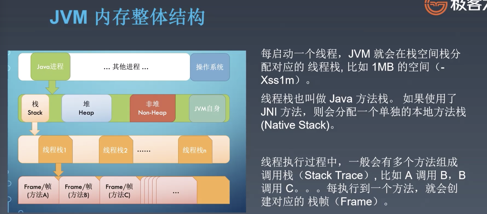
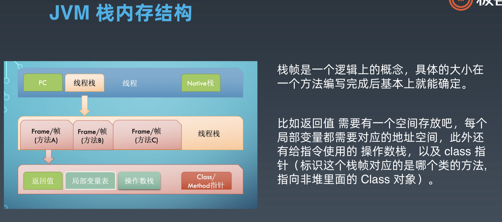
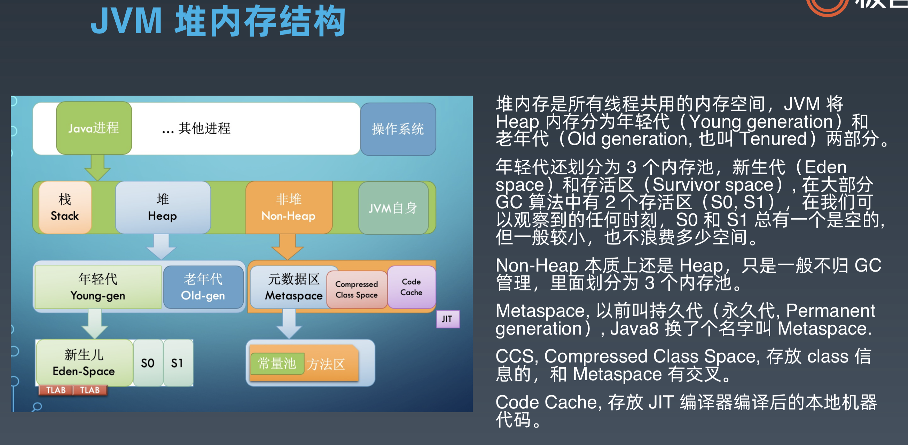
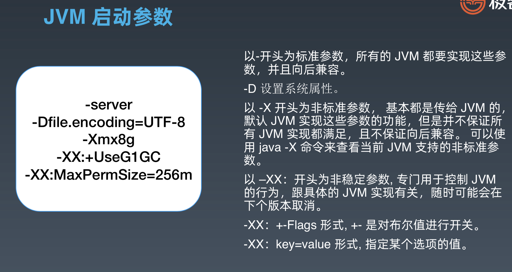

[TOC]

# JVM核心技术——基础知识

## 1 Java语言特点

Java是一种面向对象、静态类型、编译执行，有VM/GC和运行时、跨平台的高级语言。

- Java的运行时上下文就是VM，Java也是通过VM实现GC；Golang ?、Rust语言有GC，但没运行时，它在编译时检测申请内存释放的时机，自动插入释放内存的代码
- Java跨平台，属于二进制跨平台（**一次编译到处运行**），且高版本JDK向前兼容；C++的跨平台是源代码跨平台，**到新的平台需要重新编译**

## 2 字节码、类加载器、虚拟机

### 2.1 字节码技术

Java字节码`bytecode`，是Java代码编译后的中间代码格式。JVM通过读取并解析字节码来执行真正的程序。大约有200多个操作码，分为4类

1. 栈操作执行，包括与局部变量交互的指令：iload, istore, aload, astore
2. 流程控制：if_icmpge, goto
3. 对象操作，包括方法调用： 
    - invokestatic（静态方法，最快）
    - invokespecial（构造函数、private方法、超类方法）
    - invokevirtual（类似C++的虚方法，public、protected、package）
    - invokeinterface
    - invokedynamic (lambda表达式、函数指针)
1. 算数运算、类型转换 iadd, isub, imul, idiv, irem, ineg

#### 字节码分析
字节码运行时结构
- 每个线程都有一个独属于自己的线程栈（JVM Stack），用于存储栈帧（Frame）
- 栈帧由操作数栈、局部变量表以及一个 class 引用组成
- class 引用指向当前方法在运行时常量池中对应的Class

生成字节码
- 编译：`javac`
- 查看字节码：`javap -c -verbose`

#### 

Java字节码中总有有5中数据类型

- a: 引用
- i: int
- l: long
- f: float
- d: double

算数操作前会先做类型转换，编译器会在生成的字节码中包含转换的指令

# JVM内存模型

## 1. JVM内存整体结构

相关参数

| **参数名称**          | **含义**                                                   | **默认值**           | 备注                                                         |
| --------------------- | ---------------------------------------------------------- | -------------------- | ------------------------------------------------------------ |
| -Xms                  | 初始堆大小                                                 | 物理内存的1/64(<1GB) |                                                              |
| -Xmx                  | 最大堆大小                                                 | 物理内存的1/4(<1GB)  | 配置策略：**Xmx不超过空闲内存的70%**。如上图所示，Xmx表示堆Heap的大小，但是Java进程还包括栈、非堆（元空间）、JVM自身，都需要占用内存 |
| -Xmn                  | 年轻代大小(1.4or lator)                                    |                      | **注意**：此处的大小是（eden+ 2 survivor space).与jmap -heap中显示的New gen是不同的。 整个堆大小=年轻代大小 + 年老代大小 + 持久代大小. 增大年轻代后,将会减小年老代大小.此值对系统性能影响较大,Sun官方推荐配置为整个堆的3/8 |
| -XX:NewSize           | 设置年轻代大小(for 1.3/1.4)                                |                      |                                                              |
| -XX:MaxNewSize        | 年轻代最大值(for 1.3/1.4)                                  |                      |                                                              |
| -XX:PermSize          | 设置持久代(perm gen)初始值                                 | 物理内存的1/64       |                                                              |
| -XX:MaxPermSize       | 设置持久代最大值                                           | 物理内存的1/4        |                                                              |
| -Xss                  | 每个线程的堆栈大小                                         |                      | JDK5.0以后每个线程堆栈大小为1M,以前每个线程堆栈大小为256K.更具应用的线程所需内存大小进行 调整.在相同物理内存下,减小这个值能生成更多的线程.但是操作系统对一个进程内的线程数还是有限制的,不能无限生成,经验值在3000~5000左右 一般小的应用， 如果栈不是很深， 应该是128k够用的 大的应用建议使用256k。这个选项对性能影响比较大，需要严格的测试。（校长） 和threadstacksize选项解释很类似,官方文档似乎没有解释,在论坛中有这样一句话:"” -Xss is translated in a VM flag named ThreadStackSize” 一般设置这个值就可以了。 |
| -*XX:ThreadStackSize* | Thread Stack Size                                          |                      | (0 means use default stack size) [Sparc: 512; Solaris x86: 320 (was 256 prior in 5.0 and earlier); Sparc 64 bit: 1024; Linux amd64: 1024 (was 0 in 5.0 and earlier); all others 0.] |
| -XX:NewRatio          | 年轻代(包括Eden和两个Survivor区)与年老代的比值(除去持久代) |                      | -XX:NewRatio=4表示年轻代与年老代所占比值为1:4,年轻代占整个堆栈的1/5 Xms=Xmx并且设置了Xmn的情况下，该参数不需要进行设置。 |
| -XX:SurvivorRatio     | Eden区与Survivor区的大小比值                               |                      | 设置为8,则两个Survivor区与一个Eden区的比值为2:8,一个Survivor区占整个年轻代的1/10 |

## 2. JVM栈内存结构

## 3. JVM堆内存结构

# JVM启动参数

